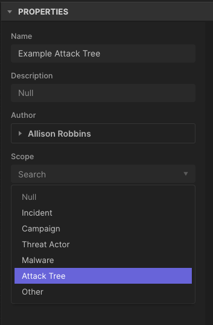
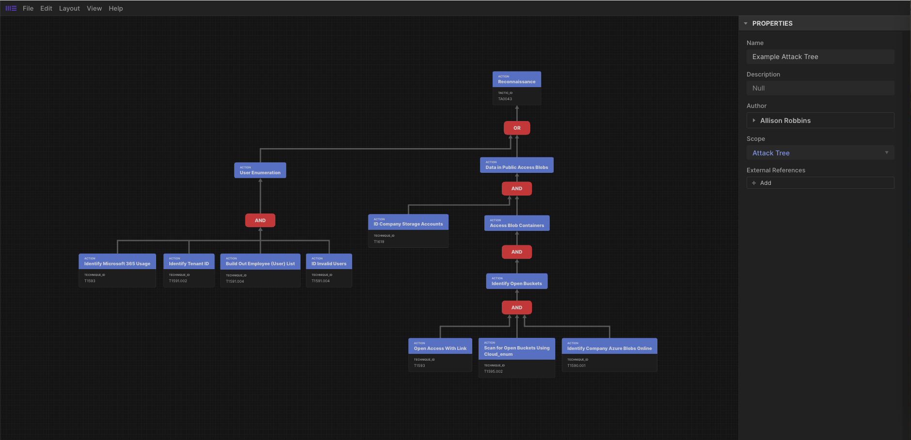
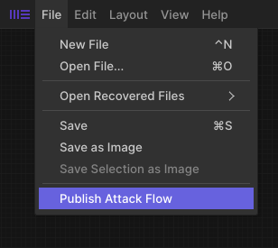
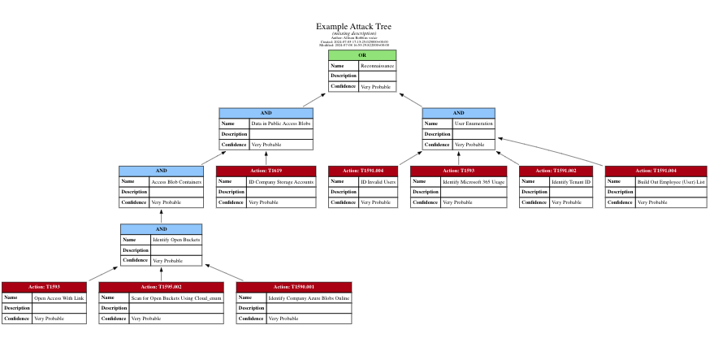
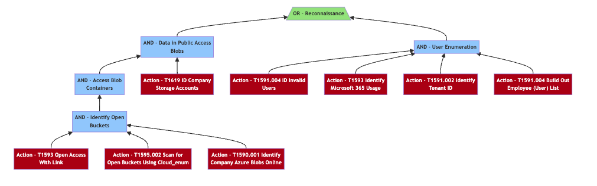

.. _Additional Resources:

Additional Resources
====================

Publications & Presentations
----------------------------

The content of this website is also available as a white paper:

.. raw:: html

  

      <a class="btn btn-primary" target="_blank" href="../presentations/threat-modeling-with-attack.pdf" download="threat-modeling-with-attack.pdf">
      <i class="fa fa-download"></i> Download White Paper</a>
  

This material was presented at `BSides CT <https://www.bsidesct.org/>`__:

.. raw:: html

  

      <a class="btn btn-primary" target="_blank" href="../presentations/tmwa-bsides-ct.pdf" download="tmwa-bsides-ct.pdf">
      <i class="fa fa-download"></i> Download Slides</a>
  

Cyber Threat Intelligence Resources
-----------------------------------

Leveraging existing CTI allows you to develop known attack vectors that could be used
against your system. There are many resources for CTI data and this appendix is made to
refence a few that we have found useful.

*	The Center’s `Sightings Ecosystem
 	<https://mitre-engenuity.org/cybersecurity/center-for-threat-informed-defense/our-work/sightings-ecosystem/>`_
 	project is an example of data that can be leveraged throughout this process to help
 	identify, or highlight, commonly seen TTPs. At the time of publish, the work
 	consists of over 1.6 million sightings of 353 unique techniques from almost 200
 	countries.
*	Many venders publish opensource reports on blogs or their websites. Monitor these
 	sources for new/relevant reports.  Attack Flow created best practices for selecting
 	open-source reports and this can be beneficial during this step:

.. important::
    * Reports should be transparent about where the data originates and provide a technically competent overview of an incident.
    * Reports should originate from a vendor with a track record of accurate reporting and first-hand analysis of the incident in question.
    * Reports should provide the most current information on the malware or breach.
    * Reports should make it easy to identify any information gaps. Use multiple sources to address gaps and corroborate the data, if possible.
    * Reports should distinguish between facts, assumptions, and analytical assessments.
    * When available, use attribution and targeting information from reports to enrich your attack flows.

*	When it comes to researching CTI for embedded systems, MITRE developed a publicly
 	available knowledge base called `EMB3D <https://emb3d.mitre.org/properties-list/>`_.
 	This is a great resource for both theory and evidence. Start by down selecting by
 	embedded system property and read through the various threats to each.

It is a good idea to have a central location/repository for all your CTI data. This can
be a spreadsheet or a threat intelligence platform (TIP) like OpenCTI (see example data
below for FIN7). There are many TIP out there that will do to research work for you –
automatically pulling in the latest vender reports. Some TIPs will even auto-parse the
data in reports for you. Be sure to spot check any automated report parsing for
accuracy.

Attack Flow
-----------

Attack Flow's builder and command line tools can be used to visualize Attack Trees. An
example Attack Tree can be found on the `Attack Flow Examples Page
<https://center-for-threat-informed-defense.github.io/attack-flow/example_flows/>`_.

Getting Started
~~~~~~~~~~~~~~~

The first step is to open the Attack Flow Builder in either the online version or run it
locally. Click the button below to open the builder in a new tab.

.. raw:: html

    

        <a class="btn btn-primary" target="_blank"
		href="https://center-for-threat-informed-defense.github.io/attack-flow/ui/">
         Open Attack Flow Builder <i class="fa fa-external-link"></i></a>
    

Build Attack Tree
~~~~~~~~~~~~~~~~~
When you open the builder and create a new flow, you will see a blank workspace.

The first step to building an Attack Tree is setting the scope attribute to Attack Tree.
Without this attribute, the Attack Tree will be rendered as a regular Attack Flow. The
scope attribute is located in the panel on the right.

  Set the scope attribute to Attack Tree.

Next, build an attack tree similarly to how you would build an attack flow. Anywhere you
want to use an operator (AND or OR node), connect the actions to the operator block.
Then, create an action object with the information you want in the operator node. When
the Attack Tree gets rendered into image format, the operator and action node will be
condensed down into one node.

  Example of a completed Attack Tree in the Attack Flow Builder.

.. caution::
  It is important that while many nodes may lead into the operator node, the operator may only point to one child node.

When you've finished building your attack tree, press Save to save the ``.afb`` format and press Publish to save the ``.json`` format.

  Press Publish to export the flow in JSON format to be able to use the render tools.

Render Attack Trees
~~~~~~~~~~~~~~~~~~~

Your first step will be to clone the Attack Flow repository onto your machine. Then,
open a terminal window in the attack-flow base repository.

Having `Node <https://docs.npmjs.com/downloading-and-installing-node-js-and-npm>`_ and
`Poetry <https://python-poetry.org/>`_ installed are prerequisites for this next step.
Refer to the `Attack Tree Developer's Guide
<https://center-for-threat-informed-defense.github.io/attack-flow/developers/>`_ initial
steps for more information on setting up your repository.

In your terminal,

.. code:: bash

    $ poetry shell

Now, identify where the file you want to transform from json to an image is located. It may be easiest to add your newly downloaded file to the corpus folder of the attack flow repository.

Visualize with Graphviz
~~~~~~~~~~~~~~~~~~~~~~~

Follow the steps in our `Developer Guide
<https://center-for-threat-informed-defense.github.io/attack-flow/developers/>`_ to
render to GraphViz. The first step is converting to
`GraphViz <https://graphviz.org/>`__ format:

.. code:: bash

    $ af graphviz corpus/attack-tree.json attack-tree.dot

The example command converts the Attack Flow ``attack-tree.json`` into GraphViz format
``attack-tree.dot``. If you have GraphViz installed, you can use one of its layout tools to
create an image:

.. code:: bash

    $ dot -Tpng -O attack-tree.dot

The rendered GraphViz png will look something like this:

  The result of converting ``attack-tree.json`` to ``attack-tree.png`` using Mermaid

Visualize with Mermaid
~~~~~~~~~~~~~~~~~~~~~~

Another visualization tool is to use `Mermaid
<https://mermaid-js.github.io/mermaid/#/>`__ .  Mermaid is a newer format with fewer
features than GraphViz, but does have the benefit that it can be embedded directly into
`GitHub-Flavored Markdown
<https://github.blog/2022-02-14-include-diagrams-markdown-files-mermaid/>`__.

Follow the steps in our `Developer Guide
<https://center-for-threat-informed-defense.github.io/attack-flow/developers/>`_ to
render to Mermaid. The first step is converting to Mermaid format:

.. code:: bash

    $ af mermaid corpus/attack-tree.json attack-tree.mmd

The example command converts the Attack Flow ``attack-tree.json`` into Mermaid format
``attack-tree.mmd``. From here you can include the mermaid code directly into markdown,
or you can run one more command to render it as an image.

.. code:: bash

    $ mmdc -i attack-tree.mmd -o attack-tree.mmd.png

The rendered GraphViz png will look something like this:

  The result of converting ``attack-tree.json`` to ``attack-tree.png`` using Mermaid

Emulation Tools Mapped to ATT&CK
--------------------------------

There are existing processes or data sources you can leverage to answer these questions.
Perhaps your organization has a process for system risk acceptance, or you actively
track system patches and compliance metrics.

Alternatively, you can stress test your system by subjecting it to some type of security
assessment. This can be accomplished through an internal or external team emulating
adversary behavior. Short of a full red teaming exercise, existing resources such the
`Adversary Emulation Library
<https://github.com/center-for-threat-informed-defense/adversary_emulation_library/>`_
and `Caldera <https://caldera.mitre.org>`_ integrate directly with MITRE ATT&CK and can
be used as part of attack simulation exercises. Other tools, like the `Atomic Red Team
<https://atomicredteam.io>`_, detail tests tied to specific ATT&CK techniques that can
be performed on your system to evaluate the strength of your mitigations.

These can all inform your secondary review and give you the answers you need. From this
secondary review, you’ll be able to ensure that your mitigations are sufficiently
tailored to your system as it evolves with time.
