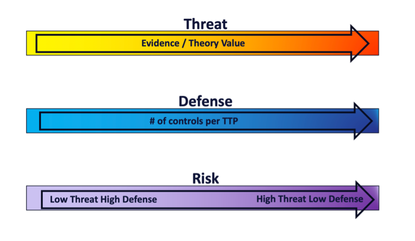

Question 3: What are we going to do about it?
=============================================

.. figure:: /Graphics/Question3Graphic.png
    :scale: 75%
    :align: center

|

Now that we have a prioritized list of TTPs our adversaries will likely use against our specific tech platform(s), we need to identify how our tech platform(s)’s existing security measures mitigate them. This section will provide a guide for using the Center’s Mappings Explorer  website to identify which existing security capabilities within your environment are mapped to the threats you're concerned about. If the Explorer’s existing mappings don’t fit your needs, this section will also introduce a process for mapping security controls and capabilities, native to a technology platform or mapping framework, to ATT&CK TTPs. These resources can be used to understand, assess, and record the real-world threats that security controls, within your technology platform, are able to mitigate. Using these Mappings, we can prioritize defensive investments against high priority TTPs targeting our technology platforms. Continuing with the AMPS example in Question 2, we will see which of the TTPs identified within our Azure attack tree branch are mitigated by leveraging the Azure mapping within Mappings Explorer.

Mappings Explorer Overview
~~~~~~~~~~~~~~~~~~~~~~~~~~

The Center provides a collection of mappings connecting security capabilities to the ATT&CK framework through Mappings Explorer. This website hosts a collection of open, independently developed mappings products, tools, and resources. These mappings form a bridge between the threat-informed approach to cybersecurity (Question 2) and the traditional security controls perspective.
Mappings Explorer enables cyber defenders to understand how security controls and capabilities map onto adversary behaviors catalogued in the ATT&CK knowledge base. The website presents security control mappings and threat and mitigation data in user-friendly ways. This enables the exploration of adversary techniques and the corresponding mapped capabilities across platforms and frameworks.
The mappings provided in Mappings Explorer are designed to provide independent data on which native security capabilities are most useful in defending against specific adversary TTPs. You will need to decide what types of capability functions are applicable for implementation in your environment and meet your threat mitigation needs.
The security capabilities of the following frameworks mapped to ATT&CK are freely and openly available:

You can use Mappings Explorer for many different purposes. In this document, we will focus on using the mappings to align cyber defenses to threats by identifying security capabilities mapped to detect, defend against, or respond to specific technology platform-based branches of our attack trees. Later in this section, we will use these resources to visualize and assess defensive coverage to identify deficiencies and plan policy and security capability implementation around adversary TTPs from Question 2.

Creating Security Capability Mappings
~~~~~~~~~~~~~~~~~~~~~~~~~~~~~~~~~~~~~

The Center uses a standard methodology to map security controls native to a technology platform to ATT&CK. As discussed previously, many of these mappings have already been done for you and are readily accessible in mappings explorer referenced in the previous section. In the event you have a technology platform that has not been mapped, the below steps are a reusable method of using ATT&CK to determine the capabilities of a platform's security offerings.

.. admonition::  The methodology consists of the following basic steps:

    #. Identify Platform Security Controls

        * Identify the native security controls available on the platform.

    #. Review Security Capability

        * For each identified control, understand the security capabilities it provides.

    #. Identify Mappable ATT&CK Techniques & Sub-techniques

        * Identify the ATT&CK techniques and sub-techniques mappable to the control.

    #. Assess and Score Control Effectiveness

        * Assess the effectiveness of the type of protection the control provides (protect, detect, or response) for the identified ATT&CK techniques and sub-techniques.

    #. Create a Mapping

        * Create a mapping based on the information gathered from the previous steps.

The full mapping methodology and scoring rubric are available on the Mappings Explorer website.

Creating Custom Mappings
~~~~~~~~~~~~~~~~~~~~~~~~

For most users, you should start with Mappings Explorer to find mappings data relevant to your environment, available for downloading the data in spreadsheet or machine-readable formats. If you have a need to produce your own customized mappings data, then you can apply the mapping methodology to the platform capabilities you have.
If you are not using one of the mapping frameworks in the Mappings Explorer collection and instead plan on creating a custom mapping for your technology platform, we recommend using the Center’s Mappings Editor tool and following the documentation to create new mappings.

Mappings Editor
~~~~~~~~~~~~~~~

Mappings Editor  is an interactive, web-based tool created by the Center for creating and updating mappings of security capabilities to ATT&CK. At the time of publication, this tool is available as a public beta.
Mappings Editor makes it quick and easy to create, edit, and review mappings and includes several features specially engineered to enhance the mapping process. The Editor is designed to streamline the creation of mapping files, which consist of one or more mappings that associate a security control, vulnerability, or capability to an adversary behavior catalogued by ATT&CK. Using the Mappings Editor, the mapping files can be exported as ATT&CK Navigator Layers or as .CSV, .JSON, .YAML, or Microsoft Excel (.XLSX) Files. To get started, review the Editor Documentation to learn how to create the initial mappings file, and then use the link provided to launch the Mappings Editor web application.

Mitigating Threats to AMPS
~~~~~~~~~~~~~~~~~~~~~~~~~~

Continuing with the AMPS device scenario, we will be looking at the security capabilities native to the Azure cloud platform. Using Mappings Explorer, we can easily identify 48 Azure security capabilities  mapped to ATT&CK techniques and sub-techniques, with a total of 978 mappings. Analyst attention can be focused on considering the applicability of these mapped security capabilities as mitigation options for the specific threats identified in Question 2.
Azure security capability mappings fall under Security Stack Mappings, which include scoring assessments for each control’s ability to protect against, detect, and respond to TTPs. These assessments are provided to reflect the security capability’s functions and ability to mitigate the mapped threats. Azure mappings are provided for the following capability function areas:

* **Protect:** capability limits or contains the impact of a (sub-)technique.
* **Detect:** capability identifies the potential occurrence of a (sub-)technique.
* **Respond:** capability provides actions to take for detected (sub-)technique.

Typically, it is recommended that capability mappings scored as Partial or Significant effectiveness at mitigating the behavior described by a (sub-) technique, be considered for implementation. If you are inclined to include a capability scored as Minimal effectiveness, carefully consider whether this control would actually be a practical means of mitigating the threat. Often, minimally scored controls could technically mitigate the behavior but in the real world would not be used for that purpose. In that case, the recommendation would be to exclude it.
Using Mappings Explorer data and looking at each of the specific TTPs identified in Q2, we identify the Azure security capabilities mappings as listed in the table below. Native Azure capabilities scored as significant or partial effectiveness for protecting against, detecting, or responding to the TTP are included, resulting in a total of 83 mappings. Note: The TTPs with strike-throughs are ones we did not score in Q2 due to time limitation but these would typically be used too.

**INSERT TABLE HERE**

The next table presents the Azure Security Capability mappings that can provide mitigation for the ATT&CK TTPs identified in Q2. The included capabilities were scored as being significant or partial effectiveness for each of the mapping categories of protect, detect, and respond in relation to the mapped technique.

**INSERT SECOND TABLE HERE**

Identify Areas of Risk
~~~~~~~~~~~~~~~~~~~~~~

During this step of the process, we will be combining scored threat TTPs that were compiled from the evidence and theory sections with the defensive capabilities mapped in the previous section. The example will continue to focus on the Azure platform and the TTPs associated with possible threats against the AMPS device. This step results in three navigator layers, the layers are optional and can be chosen to be completed based on the needs of the organization.
Start by creating two navigator layers and overlaying them for a comprehensive view:

**Layer 1: A visualization of the threat scoring determined in Question 2 (Figure below). To create this layer within Navigator, the following numbering will be used:**

.. admonition::  Scoring:

    **5 =** No theory, No evidence

    **4 =** No theory, Some evidence or Some theory, No evidence

    **3 =** No Theory, Strong Evidence or Some theory, Some Evidence or Strong theory, No evidence

    **2 =** Some theory, Strong evidence or Strong theory, Some evidence

    **1 =** Strong theory, Strong evidence

Example: T1556: Modify Authentication Process = Some theory Some Evidence = 3

Example ATT&CK Navigator Layer for Scored TTPs
^^^^^^^^^^^^^^^^^^^^^^^^^^^^^^^^^^^^^^^^^^^^^^

**Layer 2: A visualization of the number of defensive controls determined in the Question 3 mappings (Figure below).**

To figure out this range, you will count the amount of defensive capabilities for each TTP and take the highest amount and make that the maximum with the minimum being 1.

T1556: Modify Authentication Process # of defensive capabilities = 1
Maximum # of defensive capabilities = 15 (Password Spraying)

.. collapse:: Example Scoring Layer

    .. figure:: /Graphics/ScoringLayer.svg
        :scale: 75%
        :align: center
    .. raw:: html

        

            <a class="btn btn-primary" target="_blank" href="https://mitre-attack.github.io/attack-navigator/#layerURL=https://center-for-threat-informed-defense.github.io/insider-threat-ttp-kb/heatmap_InT_2.09.json">
            <i class="fa fa-map-signs"></i> Open Layer in Navigator</a>

            <a class="btn btn-primary" target="_blank" href="..\heatmap_InT_2.09.json" download="heatmap_InT_2.09.json">
            <i class="fa fa-download"></i> Download Layer JSON</a>
        

|

Example ATT&CK Navigator Layer for Number of Defensive Capabilities
^^^^^^^^^^^^^^^^^^^^^^^^^^^^^^^^^^^^^^^^^^^^^^^^^^^^^^^^^^^^^^^^^^^

Once those two layers are completed, you overlay them to create a heat map that visualizes the overall risk. On the low end we have low threat high defense and on the high end we have high threat low defense. An easy way to determine this is by adding the maximum determined for layer 2 (in our case 15) to the maximum for layer 1 (which should always be 5). The resulting number will determine the range to set for the Navigator gradient (in our case 15 + 5 = 20). Then, for each TTP, the associated number for layer 1 and layer 2 will be combined. When these are plotted on the navigator layer, light purple is low risk and dark purple is high risk.

.. collapse:: Example Defense Layer

    .. figure:: /Graphics/defenseLayer.svg
        :scale: 75%
        :align: center
    .. raw:: html

        

            <a class="btn btn-primary" target="_blank" href="https://mitre-attack.github.io/attack-navigator/#layerURL=https://center-for-threat-informed-defense.github.io/insider-threat-ttp-kb/heatmap_InT_2.09.json">
            <i class="fa fa-map-signs"></i> Open Layer in Navigator</a>

            <a class="btn btn-primary" target="_blank" href="..\heatmap_InT_2.09.json" download="heatmap_InT_2.09.json">
            <i class="fa fa-download"></i> Download Layer JSON</a>
        

|

.. admonition::  T1556 Modify Authentication Process Example:

    **Some theory Some Evidence** = 3

    **# of defensive capabilities** = 1

    **Navigator value** = 4

    **Navigator scale** = 2 – 20

.. collapse:: Example Risk Layer

    .. figure:: /Graphics/RiskLayer.svg
        :scale: 75%
        :align: center
    .. raw:: html

        

            <a class="btn btn-primary" target="_blank" href="https://mitre-attack.github.io/attack-navigator/#layerURL=https://center-for-threat-informed-defense.github.io/insider-threat-ttp-kb/heatmap_InT_2.09.json">
            <i class="fa fa-map-signs"></i> Open Layer in Navigator</a>

            <a class="btn btn-primary" target="_blank" href="..\heatmap_InT_2.09.json" download="heatmap_InT_2.09.json">
            <i class="fa fa-download"></i> Download Layer JSON</a>
        

|

.. collapse:: Scoring, Defense, and Risk Layer Video Walkthrough

    .. raw:: html

        <iframe width="560" height="315" src="https://www.youtube.com/embed/h_BC6QMWDbA?si=Abpy35U4SYKMYUeE" title="YouTube video player" frameborder="0" allow="accelerometer; autoplay; clipboard-write; encrypted-media; gyroscope; picture-in-picture; web-share" referrerpolicy="strict-origin-when-cross-origin" allowfullscreen></iframe>

|

Implementing Mitigations to Risks
~~~~~~~~~~~~~~~~~~~~~~~~~~~~~~~~~

At this stage, by leveraging the Mapping Explorer or crafting mappings of our own, we understand the mitigations within our environment and the degree to which each addresses the threats we are likely to face. By implementing these specific Azure controls, that we’ve mapped to our relevant threat TTPs, we’ve significantly reduced the potential impact of an attack.
By reviewing our overlayed Navigator layers, we can see that several TTPs, such as “Valid Accounts” (T1078), even with existing mitigations implemented within our Azure environment, remains a high risk to our system. Addressing these latent risks is a priority and your team may already have applicable controls they are aware. If you and your team can’t think of additional fixes to these threats, we recommend using the Center’s mappings of NIST 800-53. 800-53 is a list of security and privacy controls for information systems that, if implemented, can address the latent risk posed by our remaining threats.
The Valid Account technique T1078, for example, is mapped to several 800-53 controls. These include information Exchange, Usage Restrictions, Boundary Protection and many more. These controls represent best practices that can be adopted within your system to better protect against your remaining high risk TTPs. In our case, one mitigation might be changing existing policies within the environment to achieve “least functionality.” This can be done by ensuring component functionality is limited to a single function per component, removing unused or unnecessary software, or limiting unnecessary physical and logical ports and protocols to prevent unauthorized connection of components, transfer of information, and tunneling. These mitigations can further be tailored to fit your given system by collaborating with your team on potential implementations.
This mapping gives us best practices derived from NIST 800-53 to implement additional protections tailored to the risks within our system. Tailored changes constitute our best approach for securing our system against potential exploits.
